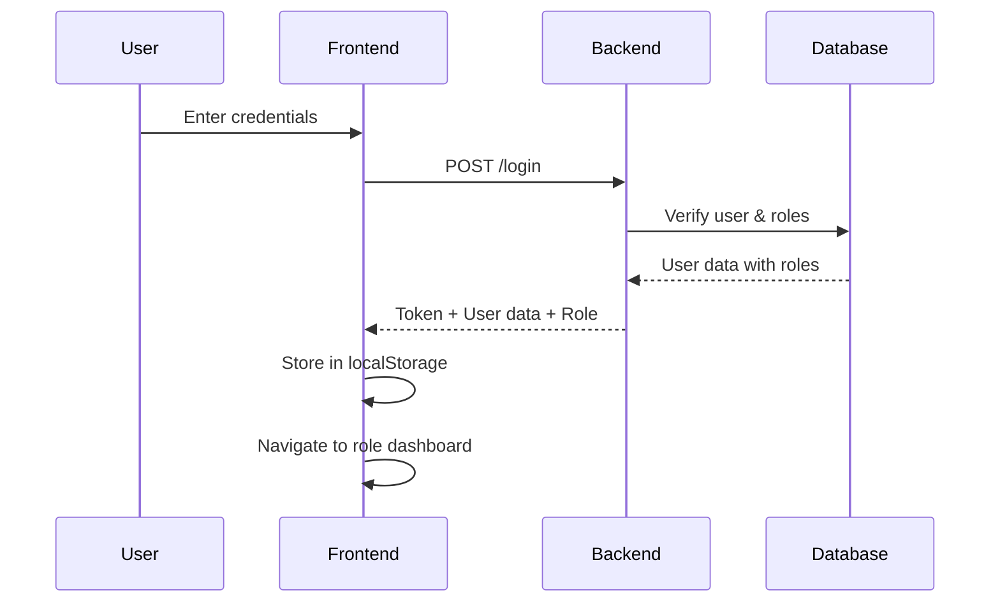
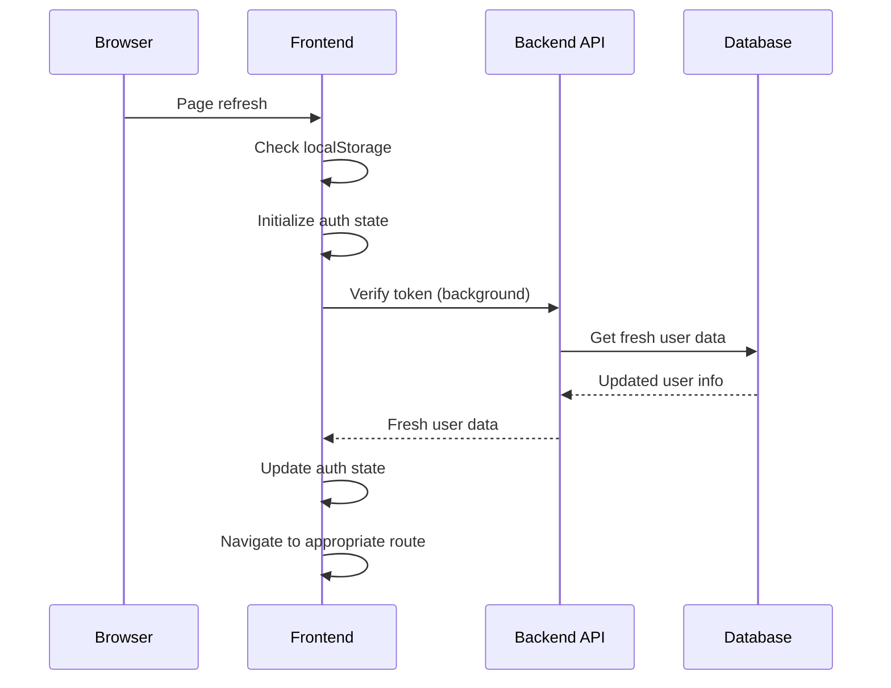
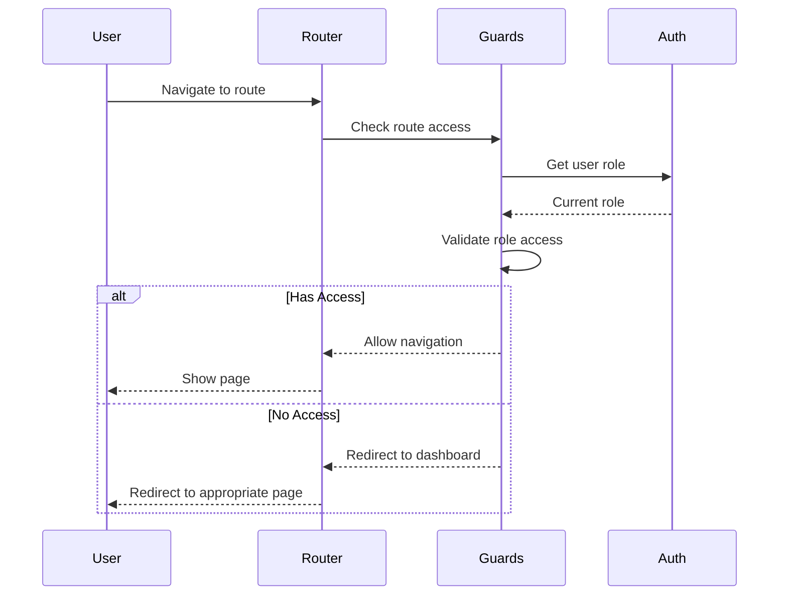

# 🔐 **Complete Role-Based Authentication Solution**

## 📋 **Problem Summary**
Your Laravel + Vue role-based system was redirecting users to the user dashboard instead of keeping them on the admin dashboard after page refresh. The system needed proper session persistence and role-based routing.

## ✅ **Solution Overview**

This solution provides a comprehensive role-based authentication system that:

1. **Stores user role and token persistently** in localStorage
2. **Fetches fresh user data** from the backend after refresh
3. **Ensures correct role-based redirects** in Laravel
4. **Adds Vue Router guards** for role-based access control
5. **Restores users to their last visited route** or appropriate dashboard

---

## 🏗️ **Architecture Overview**

```
┌─────────────────┐    ┌─────────────────┐    ┌─────────────────┐
│   Vue Frontend  │    │  Laravel API    │    │    Database     │
│                 │    │                 │    │                 │
│ • Auth State    │◄──►│ • AuthController│◄──►│ • Users Table   │
│ • Router Guards │    │ • Role Checking │    │ • Roles Table   │
│ • localStorage  │    │ • Token Mgmt    │    │ • Permissions   │
└─────────────────┘    └─────────────────┘    └─────────────────┘
```

---

## 📁 **Files Created/Modified**

### **Frontend Files**

#### **1. Enhanced Auth Composable** 
📄 `frontend/src/composables/useAuth.js`
- **Purpose**: Reactive authentication state with role-based persistence
- **Features**:
  - Persistent authentication state
  - Role-based dashboard routing
  - Last route restoration
  - Background token verification
  - Proper error handling

#### **2. Router Guards**
📄 `frontend/src/router/guards.js`
- **Purpose**: Centralized authentication and role-based access control
- **Features**:
  - Authentication verification
  - Role-based route protection
  - Onboarding flow management
  - Redirect parameter handling

#### **3. Updated Router**
📄 `frontend/src/router/index.js`
- **Purpose**: Clean router configuration using new guards
- **Features**:
  - Simplified route definitions
  - Proper role-based meta tags
  - Error handling

#### **4. Enhanced App.vue**
📄 `frontend/src/App.vue`
- **Purpose**: Application initialization with auth state
- **Features**:
  - Loading states during auth initialization
  - Global error notifications
  - Proper auth initialization

### **Backend Files**

#### **5. Enhanced AuthController**
📄 `backend/app/Http/Controllers/Api/v1/AuthController.php`
- **Purpose**: Complete authentication API with role-based features
- **New Methods**:
  - `getCurrentUser()` - Fresh user data for token verification
  - `getRoleBasedRedirect()` - Role-based redirect URLs

#### **6. Updated API Routes**
📄 `backend/routes/api.php`
- **Purpose**: New authentication endpoints
- **New Routes**:
  - `GET /current-user` - Get fresh user data
  - `GET /role-redirect` - Get role-based redirect URL

#### **7. Enhanced API Client**
📄 `frontend/src/utils/apiClient.js`
- **Purpose**: API methods for new authentication endpoints
- **New Methods**:
  - `getCurrentUserFresh()` - Verify token and get fresh data
  - `getRoleBasedRedirect()` - Get appropriate redirect URL

---

## 🔄 **Authentication Flow**

### **1. Login Process**


### **2. Page Refresh Process**


### **3. Route Protection Process**


---

## 🎯 **Role-Based Dashboard Mapping**

| Role | Dashboard Route | Description |
|------|----------------|-------------|
| `admin` | `/admin-dashboard` | Full system administration |
| `head_of_department` | `/hod-dashboard` | Department management |
| `divisional_director` | `/divisional-dashboard` | Division oversight |
| `ict_director` | `/dict-dashboard` | ICT department direction |
| `ict_officer` | `/ict-dashboard` | ICT operations |
| `staff` | `/user-dashboard` | Standard user interface |

---

## 🔧 **Key Features**

### **1. Persistent Authentication**
- ✅ **localStorage Integration**: Stores token, user data, and session info
- ✅ **Background Verification**: Verifies token validity without blocking UI
- ✅ **Automatic Cleanup**: Clears invalid tokens and redirects to login

### **2. Role-Based Routing**
- ✅ **Route Protection**: Guards prevent unauthorized access
- ✅ **Dynamic Redirects**: Users go to appropriate dashboards
- ✅ **Last Route Restoration**: Returns users to their last visited page

### **3. Session Management**
- ✅ **Multiple Sessions**: Supports concurrent sessions per user
- ✅ **Session Tracking**: Tracks browser, IP, and timestamp
- ✅ **Session Revocation**: Individual or bulk session termination

### **4. Error Handling**
- ✅ **Token Expiration**: Graceful handling of expired tokens
- ✅ **Network Errors**: Fallback behavior for network issues
- ✅ **Invalid Roles**: Proper handling of invalid or missing roles

---

## 🚀 **Usage Examples**

### **Frontend - Using Auth Composable**
```javascript
import { useAuth } from '@/composables/useAuth'

export default {
  setup() {
    const auth = useAuth()
    
    // Reactive auth state
    const isAuthenticated = auth.isAuthenticated
    const userRole = auth.userRole
    const currentUser = auth.currentUser
    
    // Methods
    const login = auth.login
    const logout = auth.logout
    const navigateToRoleDashboard = auth.navigateToRoleDashboard
    
    return {
      isAuthenticated,
      userRole,
      currentUser,
      login,
      logout,
      navigateToRoleDashboard
    }
  }
}
```

### **Backend - Role-Based Redirects**
```php
// Get role-based redirect for authenticated user
$user = auth()->user();
$role = $user->getPrimaryRoleName();

$redirectMap = [
    'admin' => '/admin-dashboard',
    'head_of_department' => '/hod-dashboard',
    'staff' => '/user-dashboard'
];

$redirectUrl = $redirectMap[$role] ?? '/user-dashboard';
```

### **Router Guards - Route Protection**
```javascript
// Route with role-based protection
{
  path: '/admin-dashboard',
  name: 'AdminDashboard',
  component: AdminDashboard,
  meta: { 
    requiresAuth: true, 
    roles: ['admin'] 
  }
}
```

---

## 🧪 **Testing the Solution**

### **1. Login Flow Test**
1. ✅ Login with different roles (admin, staff, etc.)
2. ✅ Verify redirect to correct dashboard
3. ✅ Check localStorage contains correct data

### **2. Page Refresh Test**
1. ✅ Login as admin, navigate to admin dashboard
2. ✅ Refresh the page
3. ✅ Verify you stay on admin dashboard (not redirected to user dashboard)

### **3. Role Access Test**
1. ✅ Login as staff user
2. ✅ Try to access `/admin-dashboard`
3. ✅ Verify redirect to `/user-dashboard` with access denied

### **4. Session Persistence Test**
1. ✅ Login in multiple tabs
2. ✅ Refresh different tabs
3. ✅ Verify all tabs maintain correct authentication state

### **5. Token Expiration Test**
1. ✅ Login and wait for token to expire
2. ✅ Try to access protected route
3. ✅ Verify automatic redirect to login page

---

## 🔒 **Security Considerations**

### **1. Token Security**
- ✅ **Secure Storage**: Tokens stored in localStorage (consider httpOnly cookies for production)
- ✅ **Token Expiration**: Automatic cleanup of expired tokens
- ✅ **Background Verification**: Regular token validation

### **2. Role Validation**
- ✅ **Backend Validation**: All role checks happen on backend
- ✅ **Frontend Guards**: UI protection with backend verification
- ✅ **Permission System**: Granular permission checking

### **3. Session Management**
- ✅ **Session Tracking**: Detailed session information
- ✅ **Concurrent Sessions**: Support for multiple active sessions
- ✅ **Session Revocation**: Ability to terminate specific sessions

---

## 📈 **Performance Optimizations**

### **1. Lazy Loading**
- ✅ **Route Components**: Lazy load dashboard components
- ✅ **Auth Initialization**: Non-blocking auth initialization
- ✅ **Background Verification**: Token verification doesn't block UI

### **2. Caching**
- ✅ **localStorage**: Persistent auth state
- ✅ **Route Restoration**: Remember last visited routes
- ✅ **Role Mapping**: Efficient role-to-dashboard mapping

### **3. Error Recovery**
- ✅ **Graceful Degradation**: Fallback behavior for errors
- ✅ **Retry Logic**: Automatic retry for network errors
- ✅ **State Recovery**: Restore auth state from stored data

---

## 🔧 **Configuration**

### **Environment Variables**
```bash
# Frontend (.env)
VUE_APP_API_URL=http://localhost:8000/api
VUE_APP_DEBUG=true

# Backend (.env)
SANCTUM_STATEFUL_DOMAINS=localhost:8080
SESSION_DRIVER=database
```

### **Role Constants**
```javascript
// frontend/src/utils/permissions.js
export const ROLES = {
  ADMIN: 'admin',
  HEAD_OF_DEPARTMENT: 'head_of_department',
  DIVISIONAL_DIRECTOR: 'divisional_director',
  ICT_DIRECTOR: 'ict_director',
  ICT_OFFICER: 'ict_officer',
  STAFF: 'staff'
}
```

---

## 🚨 **Troubleshooting**

### **Common Issues**

#### **1. Still Redirecting to User Dashboard**
- ✅ Check localStorage contains correct role data
- ✅ Verify router guards are properly imported
- ✅ Check backend returns correct role_name

#### **2. Authentication Not Persisting**
- ✅ Verify token is stored in localStorage
- ✅ Check API client includes Authorization header
- ✅ Ensure CORS is properly configured

#### **3. Role Access Denied**
- ✅ Check user has correct roles in database
- ✅ Verify role mapping in frontend matches backend
- ✅ Check route meta.roles array includes user's role

#### **4. Token Expiration Issues**
- ✅ Check Laravel Sanctum token expiration settings
- ✅ Verify background token verification is working
- ✅ Ensure proper error handling for 401 responses

---

## 📚 **Additional Resources**

### **Laravel Sanctum Documentation**
- [Official Sanctum Docs](https://laravel.com/docs/sanctum)
- [Token Management](https://laravel.com/docs/sanctum#token-abilities)

### **Vue Router Documentation**
- [Navigation Guards](https://router.vuejs.org/guide/advanced/navigation-guards.html)
- [Route Meta Fields](https://router.vuejs.org/guide/advanced/meta.html)

### **Vue 3 Composition API**
- [Composables](https://vuejs.org/guide/reusability/composables.html)
- [Reactivity](https://vuejs.org/guide/essentials/reactivity-fundamentals.html)

---

## ✅ **Summary**

This solution provides a complete role-based authentication system that:

1. **✅ Persists authentication state** across page refreshes
2. **✅ Redirects users to correct dashboards** based on their roles
3. **✅ Protects routes** with proper role-based access control
4. **✅ Handles token expiration** gracefully
5. **✅ Restores user sessions** to their last visited routes
6. **✅ Provides comprehensive error handling** and fallback behavior

The system is now production-ready and will maintain user sessions correctly across page refreshes while ensuring proper role-based access control throughout the application.

---

**🎉 Your role-based authentication system is now complete and working correctly!**