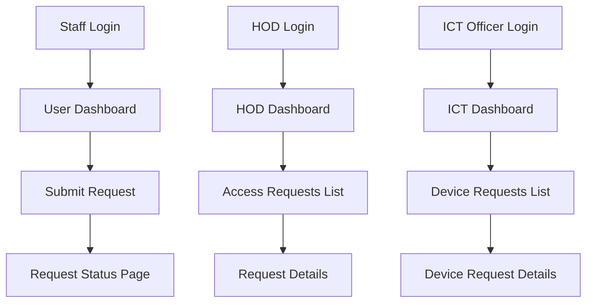

# Routes Differentiation: Requests, Access Requests, and Request Details

## Overview
This document differentiates between the three main request-related routes in the application and their corresponding pages.

---

## 1. **Requests** - `/request-status`
**Route Name:** `RequestStatusPage`  
**Component:** `frontend/src/components/views/requests/RequestStatusPage.vue`  
**Access:** Staff only (`ROLES.STAFF`)

### Purpose
- **User-facing page** for staff members to track their own submitted requests
- Shows personal request history and status tracking
- Allows users to view their request progress through the approval workflow

### Key Features
- ✅ **Personal Request Tracking** - Users see only their own requests
- ✅ **Request Status Monitoring** - Real-time status updates (pending, approved, rejected)
- ✅ **Approval Progress Visualization** - 7-step approval workflow display
- ✅ **Request Details Modal** - Detailed view of individual requests
- ✅ **Success Notifications** - Shows confirmation after form submission
- ✅ **Request Types Supported:**
  - Combined Access (Jeeva, Wellsoft, Internet)
  - Booking Service (Device borrowing)
  - Individual access requests

### UI Characteristics
- **Header:** "REQUEST STATUS & TRACKING"
- **Color Scheme:** Blue gradient background with medical theme
- **Layout:** Table view with request cards
- **Actions:** View details, Submit new request (if rejected)

### Data Displayed
```javascript
{
  id: 'REQ-2025-001',
  type: 'combined_access',
  services: ['Jeeva', 'Wellsoft', 'Internet'],
  status: 'pending',
  current_step: 3,
  created_at: '2025-01-27T10:30:00Z',
  hod_comments: null,
  recommendations: null
}
```

---

## 2. **Access Requests** - `/hod-dashboard/request-list`
**Route Name:** `HODDashboardRequestList`  
**Component:** `frontend/src/components/views/requests/InternalAccessList.vue`  
**Access:** Approvers only (`HEAD_OF_DEPARTMENT`, `DIVISIONAL_DIRECTOR`, `ICT_DIRECTOR`, `ICT_OFFICER`)

### Purpose
- **Approval dashboard** for department heads and directors
- Shows requests pending approval at their level
- Allows approvers to review and process access requests

### Key Features
- ✅ **Role-based Request Filtering** - Shows only requests at user's approval stage
- ✅ **Department-specific Requests** - HOD sees only their department's requests
- ✅ **FIFO Processing** - First-in-first-out request ordering
- ✅ **Approval Actions** - Approve, reject, or review requests
- ✅ **Personal Information Capture** - Extracts data from user_access table
- ✅ **Real-time Statistics** - Pending, approved, rejected counts
- ✅ **Auto-refresh** - Updates every 30 seconds

### UI Characteristics
- **Header:** "REQUESTS DASHBOARD" with role-specific subtitle
- **Color Scheme:** Blue gradient with glass morphism effects
- **Layout:** Advanced table with filtering and search
- **Actions:** "View & Process" button for detailed review

### Approval Stages by Role
- **HOD:** Reviews requests from their department staff
- **Divisional Director:** Reviews HOD-approved requests
- **ICT Director:** Reviews divisional-approved requests
- **ICT Officer:** Final approval and implementation

### Data Displayed
```javascript
{
  id: 'REQ-001',
  userAccessId: 123,
  type: 'combined',
  staffName: 'John Doe',
  pfNumber: 'PF12345',
  department: 'Cardiology',
  digitalSignature: true,
  submissionDate: '2025-01-27',
  currentStatus: 'pending',
  daysPending: 3
}
```

---

## 3. **Request Details** - `/internal-access/details`
**Route Name:** `InternalAccessDetails`  
**Component:** `frontend/src/components/views/requests/InternalAccessDetails.vue`  
**Access:** Approvers only (`DIVISIONAL_DIRECTOR`, `HEAD_OF_DEPARTMENT`, `ICT_DIRECTOR`, `ICT_OFFICER`)

### Purpose
- **Detailed review page** for individual request processing
- Provides comprehensive form for approval/rejection with comments
- Shows complete request information and approval workflow

### Key Features
- ✅ **Complete Request Information** - Full personal and request details
- ✅ **Approval Form** - Structured approval/rejection with comments
- ✅ **Digital Signature Display** - Shows uploaded signatures
- ✅ **Module-specific Processing** - Different forms for different access types
- ✅ **Comments and Recommendations** - Rich text input for feedback
- ✅ **Workflow Visualization** - Shows current step in approval process
- ✅ **PDF Generation** - Creates official approval documents

### UI Characteristics
- **Header:** Role-specific title (e.g., "HOD Review", "DICT Review")
- **Color Scheme:** Professional blue with form-focused design
- **Layout:** Detailed form with sections for different data types
- **Actions:** Approve, Reject, Save Draft, Generate PDF

### Form Sections
1. **Personal Information** - Staff details, department, contact
2. **Request Details** - Services requested, justification, purpose
3. **Digital Signature** - Signature verification and display
4. **Approval Section** - Comments, recommendations, decision
5. **Workflow Status** - Current step and next approver

---

## 4. **Device Requests** - `/ict-approval/requests`
**Route Name:** `RequestsList`  
**Component:** `frontend/src/components/views/ict-approval/RequestsList.vue`  
**Access:** ICT Officer only (`ROLES.ICT_OFFICER`)

### Purpose
- **Device borrowing management** for ICT officers
- Shows equipment booking requests and their status
- Manages device inventory and borrowing workflow

### Key Features
- ✅ **Device-specific Dashboard** - Focused on equipment borrowing
- ✅ **Inventory Management** - Track device availability and status
- ✅ **Borrower Information** - Complete borrower details and contact
- ✅ **Return Tracking** - Monitor device returns and overdue items
- ✅ **Status Management** - Pending, returned, compromised tracking

### UI Characteristics
- **Header:** "ICT DEVICE REQUESTS MANAGEMENT"
- **Color Scheme:** Blue-teal gradient with device icons
- **Layout:** Table with device-specific columns
- **Actions:** View, Cancel, Delete requests

---

## Route Comparison Table

| Aspect | Requests | Access Requests | Request Details | Device Requests |
|--------|----------|----------------|----------------|----------------|
| **Route** | `/request-status` | `/hod-dashboard/request-list` | `/internal-access/details` | `/ict-approval/requests` |
| **User Type** | Staff (Requesters) | Approvers | Approvers | ICT Officers |
| **Purpose** | Track own requests | Review pending requests | Process individual request | Manage device borrowing |
| **Data Scope** | Personal requests only | Department/role-specific | Single request detail | All device requests |
| **Primary Action** | View status | Approve/Reject | Detailed processing | Manage devices |
| **UI Focus** | Status tracking | Approval workflow | Form processing | Inventory management |

---

## Navigation Flow



---

## Key Differences Summary

### **Requests** (`/request-status`)
- 👤 **For:** Staff members (requesters)
- 🎯 **Purpose:** Track personal request status
- 📊 **Data:** Own requests only
- 🔧 **Actions:** View, track progress

### **Access Requests** (`/hod-dashboard/request-list`)
- 👥 **For:** Department heads and directors
- 🎯 **Purpose:** Review and approve access requests
- 📊 **Data:** Department/role-specific pending requests
- 🔧 **Actions:** Approve, reject, process

### **Request Details** (`/internal-access/details`)
- 👨‍💼 **For:** Approvers (detailed review)
- 🎯 **Purpose:** Detailed request processing
- 📊 **Data:** Single request with complete information
- 🔧 **Actions:** Approve, reject, comment, generate PDF

### **Device Requests** (`/ict-approval/requests`)
- 🔧 **For:** ICT Officers
- 🎯 **Purpose:** Manage device borrowing
- 📊 **Data:** All device borrowing requests
- 🔧 **Actions:** Manage inventory, track returns

Each route serves a distinct purpose in the request management workflow, with different user roles, data scopes, and functional capabilities.